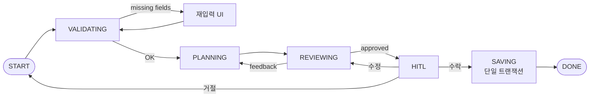
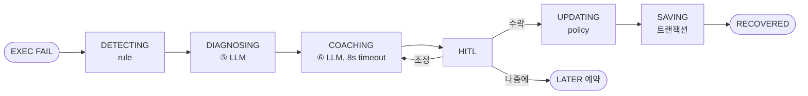

# re:action Backend — Architecture

> 단순 RESTful CRUD 백엔드가 아니다. **AI 에이전트 + 4계층 메모리** 시스템이다.
> 기준 문서: `Reaction_DevBaseline_v1.0_2026-05-15`, `Reaction_DB_설계서_v0.7.1`, `ReAction_AI_에이전트_플로우_분석.md`

---

## 1. 레이어 한눈에

```
┌────────────────────────────────────────────────────────────┐
│ FastAPI Routers  (16 도메인, api/routes/)                  │
│   ↳ Pydantic schemas  (schemas/)                           │
└────────────────────────────────────────────────────────────┘
                       │
                       ▼
┌────────────────────────────────────────────────────────────┐
│ Orchestrators (상태머신, LLM 직접 호출 X)                  │
│   • goal_structuring  • recovery  • interview              │
└────────────────────────────────────────────────────────────┘
                       │
                       ▼
┌────────────────────────────────────────────────────────────┐
│ Worker Agents (단일 책임, agents/)                         │
│  validation · planning · scheduler(rule) · review          │
│  failure_diagnosis · recovery_coach · policy_update        │
│  weekly_review · interview · execution_logger              │
└────────────────────────────────────────────────────────────┘
            │                   │                  │
            ▼                   ▼                  ▼
┌──────────────────┐ ┌───────────────────┐ ┌──────────────────┐
│ LLM Tool Executor│ │ Calendar Tool     │ │ Notification Tool│
│  llm/            │ │ integrations/     │ │ scheduler/       │
│  Gemini + retry  │ │  google_calendar  │ │  + budget enforce│
└──────────────────┘ └───────────────────┘ └──────────────────┘
                       │
                       ▼
┌────────────────────────────────────────────────────────────┐
│ Memory (4 계층, memory/ + db/)                             │
│  Planning · Raw Execution · Derived Stats · Policy Snapshot │
└────────────────────────────────────────────────────────────┘
```

---

## 2. Orchestrator 상태머신

### 2.1 Goal Structuring (계획 생성)



LLM 호출: ①Validation ②③Planning ④Review (총 4회). DB write는 단일 트랜잭션, 정책 위반 시 즉시 rollback.

### 2.2 Recovery (회복)



LLM 호출: ⑤Failure Diagnosis ⑥Recovery Coach. 8초 안에 응답 없으면 룰 fallback 3종 (`plan_too_big→downscope`, `time_shortage→reschedule tomorrow`, `fatigue→carry_over+rest`).

원본 `action_item.status` (FAILED) 절대 변경 X — Resilience 지표 전제.

### 2.3 Interview (딥 인터뷰 모호함 0 루프)

```mermaid
flowchart LR
  S([START]) --> I[INIT 세션 생성]
  I --> A[ASK_NEXT_SLOT<br/>모호함 큰 슬롯 우선]
  A --> R[RECEIVE_ANSWER<br/>UPSERT slot_answer]
  R --> U[UPDATE_AMBIGUITY<br/>clarity 채점]
  U -->|모호함=0| D
  U -->|15턴| D
  U -->|[충분해요]| D
  U -->|계속| A
  D([DONE]) --> CONFIRM[S03 Confirm 진입]
```

매 턴 LLM 호출 (질문 결정 + clarity 채점 + 답 정규화 + 공감 1줄 + 금지어 필터).

---

## 3. Worker Agents (9 + α)

| Agent | LLM Call # | 주된 입력 | 주된 출력 |
| --- | --- | --- | --- |
| Interview | 매 턴 | 현재 슬롯 + 직전 답 + 모호함 | 다음 질문 + clarity_score + 정규화된 값 |
| Validation | ① | Goal 입력 | `missing_fields[]` |
| Planning | ②③ | goals + policy + freebusy + behavioral | goal_nodes + action_items |
| Scheduler (rule) | — | action_items + time_policy | scheduled_blocks |
| Review | ④ | scheduled plan | approve / feedback[] |
| Execution Logger | — | check-in 입력 | execution_event + context_snapshot |
| Failure Diagnosis | ⑤ | failure tags + context | failure_type + confidence |
| Recovery Coach | ⑥ | diagnosis + interruption + catalog | recovery_attempts (후보) |
| Policy Update | (선택) | weekly KPI | policy_snapshot 후보 |
| Weekly Review | (있음) | week 전체 데이터 | period_summary + insights |

---

## 4. Tool Executor (외부 호출 단일 게이트)

| Tool | 책임 | 보호 장치 |
| --- | --- | --- |
| LLM (Gemini) | structured output, function call | circuit breaker + 3회 retry + 8s timeout + fallback heuristic + 금지어 후처리 |
| Calendar | OAuth + freebusy + events.insert | 60s 캐시 + Idempotency-Key + externalCalendarEventId 가드 |
| Notification | Web Push 발송 | 주 ≤ 3건 + 23~07시 금지 + 24h 클래스 중복 금지 |
| DB | 단일 트랜잭션 | 정책 위반 rollback + soft delete only |

---

## 5. Memory (4 계층)

```
Planning Layer
  └─ goals / goal_nodes / habits / habit_instances / action_items
     scheduled_blocks / time_policies / fixed_schedules / dependency_links
     calendar_connections / behavioral_profiles / interaction_styles / interview_*

Raw Execution Memory
  └─ execution_events / interruption_events (v0.6) / context_snapshots (v0.6 14필드)
     execution_failure_tags / failure_reason_tags (master) / recovery_strategy_catalog (v0.7)
     recovery_attempts

Derived Stats
  └─ period_summaries / daily_briefs (v0.7 캐시)

Policy Snapshot
  └─ policy_snapshots (버전 이력)
```

P2: **Semantic Memory (Vector DB)** — insight embedding 으로 Recovery Coach 맥락 검색

---

## 6. 시간 트리거 (`scheduler/`)

| 시각 (사용자 timezone) | 작업 | 입력 → 출력 |
| --- | --- | --- |
| 06:00 | `daily_brief_precompute` | yesterday data → `daily_briefs` (LLM 1회) |
| 매 카드 2분 전 (옵션) | `pre_card_dispatch` | scheduled_blocks → push |
| 21:00 | `evening_reflection_notify` | (시간 도달) → push |
| 일요일 03:00 | `weekly_review_precompute` | week data → `period_summaries` (LLM) |
| 월요일 00:00 | `habit_instances_generator` | habits → 이번 주 instances |
| 6시간마다 | `interruption_resolver` | NULL resumed_after_interrupt → false |
| 04:00 KST | `anonymize_inactive_users` | 90일 비활성 → 익명화 |
| 1시간마다 | `oauth_token_refresher` | 만료 임박 토큰 → refresh |

모든 cron은 **idempotent**.

---

## 7. HITL (Human-in-the-Loop) 게이트

AI 출력은 **반드시** [수락] / [수정] / [거절] 3분기 전에 멈춘다. Verifier가 자동 검증 후 사용자에게 전달.

| Verifier | 검증 항목 |
| --- | --- |
| Plan Verifier | 정책 위반 / 충돌 / 워크로드 |
| Recovery Verifier | before/after diff / workloadChange |
| Policy Verifier | 새 vs 이전 PolicySnapshot diff |

자동 적용은 모든 경우에서 금지. Calendar write조차 사용자 명시 승인 후만.

---

## 8. 외부 의존성 (현재 기준)

| 영역 | 선택 | 비고 |
| --- | --- | --- |
| Runtime | Python 3.12 + FastAPI + uvicorn | uv 패키지 관리 |
| LLM | Gemini (잠금) | Tool Executor 경유, 직접 SDK 호출 금지 |
| DB | PostgreSQL — staging: **AWS RDS**(us-west-2), 로컬: Supabase(ap-northeast-2) | 컬럼 암호화. RLS는 후속. 전환 경위는 [DEPLOY_AWS.md](DEPLOY_AWS.md) 상단 참고 |
| Cache (P1) | Redis (선택) | freebusy / daily_brief 캐시 |
| OAuth | Google OAuth | id_token 검증 |
| Push | Web Push API | 표준 subscription 객체 저장 |
| Scheduler | APScheduler 또는 Arq | 분산 필요 시 Arq |
| Observability (P1) | Prometheus + JSON 로그 | |
