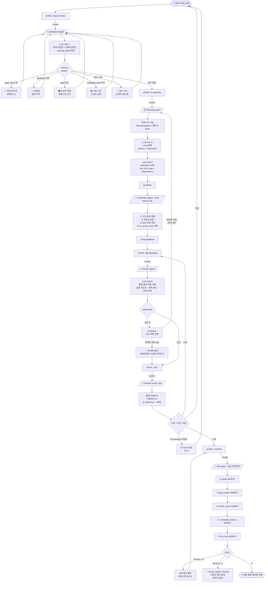
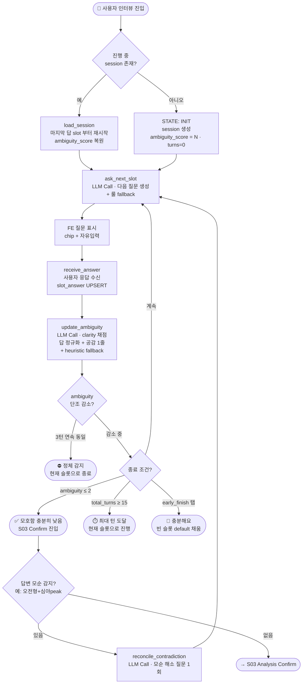
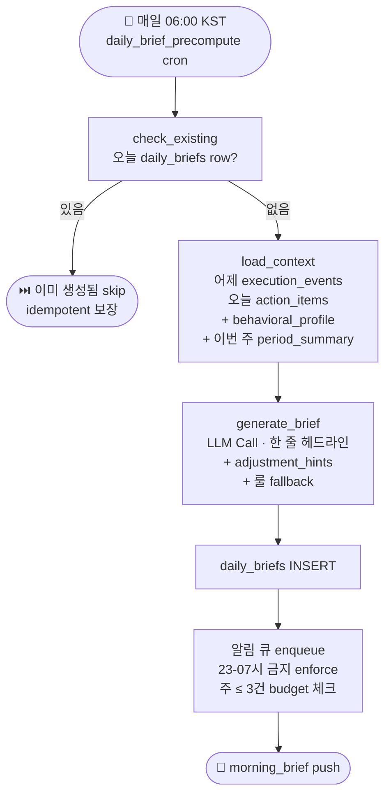
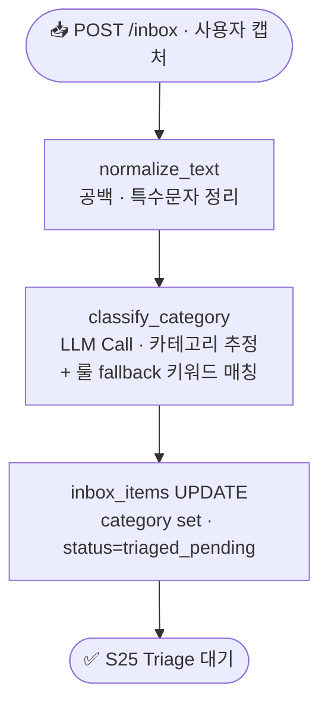
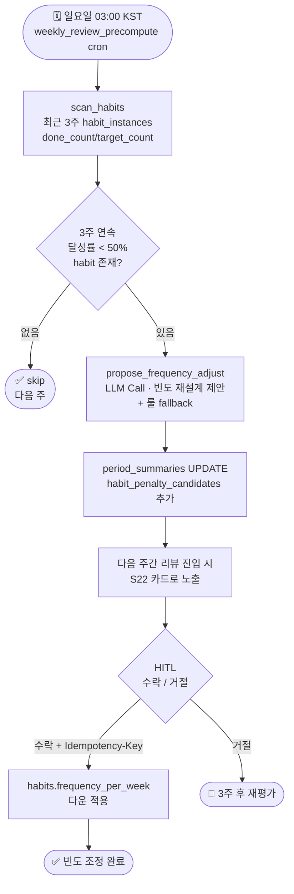
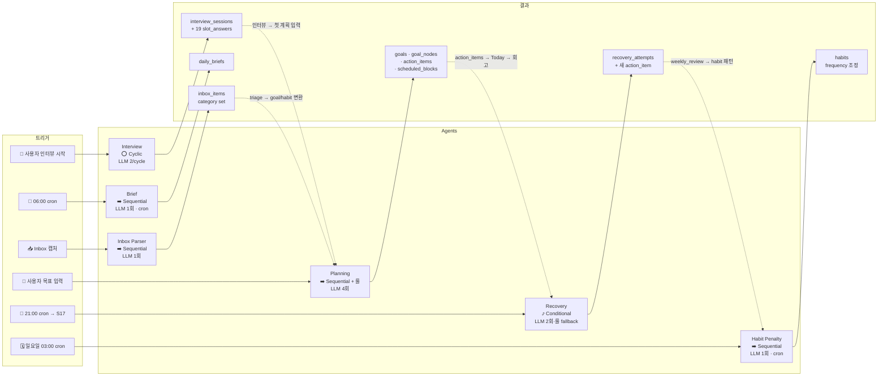

# ADR 0005 — Agentic Architecture for Alpha MVP (LangGraph 채택)

| 항목 | 내용 |
| --- | --- |
| Status | **Accepted** |
| Date | 2026-05-24 |
| Deciders | PM Mbt70 (단독 결정, 팀원 요청에 따른 설계) |
| Reviewers | @peterchopg (AI) · @hyeongjun22 (BE) · @choigod1023 (FE) |
| Supersedes | — |
| Related | ADR-0003 (LLM Tool Executor 시그니처 동결, PR #33) · 베이스라인 §부록 D Q9 |

---

## 1. Context

Issue #6 (Deep Interview), Issue #20 (Recovery), Issue #32 (Planning LLM 통합) 등 5 AI 모듈 본격 구현 직전이다. 베이스라인 §부록 D Q9 ("LangGraph 채택 여부 — AI 파트 1주 PoC 후 결정") 가 미해결 상태로 남으면 각 Agent 가 제각각의 패턴으로 구현되어 통합 리뷰가 불가능해진다.

### 1.1 결정해야 할 이유
- 5 Agent (Interview / Planning / Brief / Recovery / Inbox Parser) 가 **각자 다른 orchestration 패턴**으로 구현되면 디버깅·튜닝·확장 모두 어려워짐
- 베이스라인 §1.4 잠금 결정 다수 (HITL 게이트 / 8s timeout / 룰 fallback / Draft Layer) 를 5 Agent 가 일관되게 준수해야 함
- 2주 MVP 일정상 "1주 PoC 후 결정" 절차를 따를 시간 부족 → PM 단독 결정 + 팀 사후 추인 절차로 진행

### 1.2 현재 코드 전제
- PR #33 (Issue #5 LLM Infra) — `aiClient.run(module, schema, prompt_id, fallback, timeout=8.0)` 단일 게이트 동결 (ADR-0003). 본 ADR 은 **PR #33 머지를 전제**로 한다.
- PR #30 (Issue #18 룰 부분) — `orchestrator/goal_structuring.py` 룰 기반 스케줄러 (Planning Agent 의 fallback 으로 활용 예정).
- PR #34 (Issue #16 Auth) — `get_current_user` 의존성 + JWT 세션. 모든 Agent 호출은 인증 필수.

---

## 2. Decision

**LangGraph 채택** + **PR #33 `aiClient.run(...)` 단일 게이트를 LangGraph Node 내에서 직접 사용** + **베이스라인 §12.1 5개 Agent 분리**.

### 2.1 8개 영역 결정 요약

| # | 영역 | 결정 | 근거 |
| --- | --- | --- | --- |
| 1 | **프레임워크** | **LangGraph** (`langgraph >= 0.2.x`) | State + Node + Edge 가 베이스라인 §6 "슬롯 채우기 + 모호함 0 까지 cycle" 과 직접 매핑. 상태 시각화 (Mermaid) 가 시연 자료 + 디버깅에 강점. |
| 2 | **LangChain 의존성 범위** | `langchain-core` 만 (= langgraph 의 transitive dep). `langchain` / `langchain-openai` 등 **전체 ecosystem 금지** | 의존성 무게 최소화, 보안 surface 최소화 |
| 3 | **LLM 호출 경로** | LangGraph Node 안에서 `aiClient.run(...)` **직접 호출**. LangChain ChatModel wrapping 금지 | AGENTS.md §2 "LLM SDK 직접 import 금지" 룰 유지. PR #33 의 budget · banned words · llm_runs 로깅 일관 적용 |
| 4 | **Agent 분리 수준** | **5 Agent** (Interview / Planning / Brief / Recovery / Inbox Parser) + **룰 sub-helper** (Validation · Review · Failure Diagnosis · Scheduler) | 베이스라인 §12.1 그대로. 9 Agent 세분화는 Phase 3 |
| 5 | **Orchestrator 패턴** | Interview: **Cyclic StateGraph** · Recovery: **Conditional StateGraph** · Brief / Inbox: **Sequential** · Planning: **Sequential + 룰 fallback** | architecture.md §2 명시된 상태머신 그대로 |
| 6 | **State 관리** | **DB-backed** (`interview_sessions`, `recovery_attempts` 등 기존 모델) + LangGraph `MemorySaver` (단일 요청 내 short-lived) | 재진입 가능 + 디버깅 용이. Redis 는 P2 |
| 7 | **Tool Calling** | **Structured Output (Pydantic schema)** — PR #33 현재 그대로 | Function calling 변경 시 fallback 룰 복잡도 ↑ |
| 8 | **Observability** | `llm_runs` 자체 로깅 (PR #33) + 매주 30분 "오류 잔치" (베이스라인 §12.4) | LangSmith / LangFuse 는 Phase 2 |

### 2.2 시스템 다이어그램

```
┌─────────────────────────────────────────────────────────────────┐
│ FastAPI Routers (PR #34 인증 + ADR-0002 envelope)               │
│   ↳ interview / planning / today / reflection / recovery / ... │
└─────────────────────────────────────────────────────────────────┘
                          ▼
┌─────────────────────────────────────────────────────────────────┐
│ Orchestrators (LangGraph StateGraph) ⭐ 본 ADR                  │
│   • interview/graph.py      (Cyclic)                            │
│   • recovery/graph.py       (Conditional, 룰 fallback 3종)      │
│   • planning/graph.py       (Sequential, LLM 4 + 룰)            │
│   • brief/graph.py          (Sequential 단순)                   │
│   • inbox_parser/graph.py   (Sequential 단순)                   │
└─────────────────────────────────────────────────────────────────┘
                          ▼ (Node 내부)
┌─────────────────────────────────────────────────────────────────┐
│ LLM Tool Executor — aiClient.run(...) (ADR-0003, PR #33)        │
│   • Structured Output · prompts/registry · safety/banned_words  │
│   • llm_budget.check/record · timeout 8s · 룰 fallback          │
└─────────────────────────────────────────────────────────────────┘
                          ▼
┌─────────────────────────────────────────────────────────────────┐
│ Gemini API (격리, AGENTS.md §2)                                 │
└─────────────────────────────────────────────────────────────────┘
```

### 2.3 Interview Agent 예시 코드 (Cyclic StateGraph)

본 예시는 팀원이 다른 Agent 작성 시 참고할 **canonical pattern**.

```python
# src/reaction_backend/orchestrator/interview.py
from typing import TypedDict
from uuid import UUID

from langgraph.graph import StateGraph, END

from reaction_backend.llm.tool_executor import aiClient
from reaction_backend.schemas.interview import NextQuestionSchema, AmbiguityUpdate


class InterviewState(TypedDict):
    """LangGraph 가 Node 간 전달하는 상태. DB 와 별도 (short-lived)."""
    session_id: UUID
    ambiguity_score: int
    total_turns: int
    last_answer: str | None
    next_question: NextQuestionSchema | None
    early_finish: bool  # 사용자 [충분해요] 탭


async def ask_next_slot(state: InterviewState) -> InterviewState:
    """LLM 호출 — 다음 질문 생성. PR #33 aiClient.run 그대로 사용."""
    result = await aiClient.run(
        module="interview",
        schema=NextQuestionSchema,
        prompt_id="interview/next_question",
        fallback=rule_based_next_question,  # 8s timeout 시 룰 fallback
        timeout=8.0,
        variables={"current_ambiguity": str(state["ambiguity_score"])},
    )
    return {**state, "next_question": result.value, "total_turns": state["total_turns"] + 1}


async def receive_answer(state: InterviewState) -> InterviewState:
    """사용자 답 수신 (라우터에서 주입). DB 업데이트는 별도."""
    # 이 노드는 외부 트리거 (POST /interview/sessions/{id}/answers) 로 진입
    return state


async def update_ambiguity(state: InterviewState) -> InterviewState:
    """clarity 채점 + 모호함 지표 갱신. LLM 호출 — 답 정규화 포함."""
    result = await aiClient.run(
        module="interview",
        schema=AmbiguityUpdate,
        prompt_id="interview/ambiguity_score",
        fallback=heuristic_ambiguity_update,
        timeout=8.0,
        variables={"answer": state["last_answer"] or ""},
    )
    return {**state, "ambiguity_score": result.value.new_score}


def should_continue(state: InterviewState) -> str:
    """Cycle 종료 조건. 베이스라인 §2.5 핵심."""
    if state["ambiguity_score"] == 0:
        return END
    if state["total_turns"] >= 15:  # 베이스라인 §6 최대 15턴
        return END
    if state["early_finish"]:
        return END
    return "ask_next_slot"


def build_interview_graph() -> StateGraph:
    graph = StateGraph(InterviewState)
    graph.add_node("ask_next_slot", ask_next_slot)
    graph.add_node("receive_answer", receive_answer)
    graph.add_node("update_ambiguity", update_ambiguity)

    graph.set_entry_point("ask_next_slot")
    graph.add_edge("ask_next_slot", "receive_answer")
    graph.add_edge("receive_answer", "update_ambiguity")
    graph.add_conditional_edges("update_ambiguity", should_continue)

    return graph.compile()
```

### 2.4 Recovery Agent 예시 (Conditional)

```python
# src/reaction_backend/orchestrator/recovery.py
from typing import TypedDict
from uuid import UUID

from langgraph.graph import StateGraph, END

from reaction_backend.llm.tool_executor import aiClient
from reaction_backend.schemas.recovery import FailureDiagnosis, RecoveryProposalSet


class RecoveryState(TypedDict):
    """recovery_attempts 작성 직전까지 누적되는 short-lived state."""
    user_id: UUID
    execution_id: UUID
    failure_tags: list[str]          # S18 0~2개
    context_snapshot: dict           # v0.6 14필드
    diagnosis: FailureDiagnosis | None
    proposals: RecoveryProposalSet | None
    used_fallback: bool


async def diagnose_failure(state: RecoveryState, config: dict) -> RecoveryState:
    """LLM ⑤ — failure_tags + context → failure_type + confidence.

    fallback: 룰 (failure_tag 1순위 사유 → strategy 매핑, 베이스라인 §부록 C).
    """
    result = await aiClient.run(
        module="recovery",
        schema=FailureDiagnosis,
        prompt_id="failure_diagnosis/classify",
        fallback=lambda: heuristic_diagnosis(state["failure_tags"]),
        timeout=8.0,
        variables={
            "tags": ",".join(state["failure_tags"]),
            "context": str(state["context_snapshot"]),
        },
        session=config["configurable"]["session"],
    )
    return {**state, "diagnosis": result.value, "used_fallback": result.fell_back}


async def generate_proposals(state: RecoveryState, config: dict) -> RecoveryState:
    """LLM ⑥ — diagnosis → if-then 후보 2~4개.

    fallback: 룰 3종 (베이스라인 §부록 C):
      - plan_too_big / hard_to_start  → DOWNSCOPE (NANO_STEP)
      - time_shortage / overrun       → RESCHEDULE (tomorrow)
      - fatigue / low_energy          → CARRY_OVER + 휴식
    """
    result = await aiClient.run(
        module="recovery",
        schema=RecoveryProposalSet,
        prompt_id="recovery/if_then_proposal",
        fallback=lambda: heuristic_recovery_proposals(state["diagnosis"]),
        timeout=8.0,
        session=config["configurable"]["session"],
    )
    return {
        **state,
        "proposals": result.value,
        "used_fallback": state["used_fallback"] or result.fell_back,
    }


async def heuristic_recovery(state: RecoveryState, config: dict) -> RecoveryState:
    """LLM 0회 — 베이스라인 §부록 C 룰 매핑만으로 후보 생성.

    diagnose_failure 가 fallback 됐거나 confidence < 0.5 일 때 진입.
    """
    proposals = heuristic_recovery_proposals(state["diagnosis"])
    return {**state, "proposals": proposals, "used_fallback": True}


def should_use_heuristic(state: RecoveryState) -> str:
    """diagnose_failure 결과를 보고 LLM 진단이 신뢰 가능한지 분기.

    `CONFIDENCE_THRESHOLD = 0.5` 는 **MVP 초기 임시값** (Gemini 2.0 Flash 의 평균 calibration
    이 0.5 부근에서 정상/이상 갈리는 경험치). 베이스라인 §12.4 "매주 30분 오류 잔치" 에서
    LLM 출력 50 개 라벨링 결과로 보정. 베타 진입 시 confidence 분포 보고 재조정.
    """
    CONFIDENCE_THRESHOLD = 0.5  # ⚠️ MVP 임시값. 베타에서 데이터 보고 조정.

    if state["diagnosis"] is None:
        return "heuristic_recovery"          # 진단 자체 실패
    if state["used_fallback"]:
        return "heuristic_recovery"          # 진단이 룰 fallback → 회복도 룰
    if state["diagnosis"].confidence < CONFIDENCE_THRESHOLD:
        return "heuristic_recovery"          # 신뢰 낮음 → 룰
    return "generate_proposals"


def build_recovery_graph():
    graph = StateGraph(RecoveryState)
    graph.add_node("diagnose_failure", diagnose_failure)
    graph.add_node("generate_proposals", generate_proposals)
    graph.add_node("heuristic_recovery", heuristic_recovery)

    graph.set_entry_point("diagnose_failure")
    graph.add_conditional_edges("diagnose_failure", should_use_heuristic)
    graph.add_edge("generate_proposals", END)
    graph.add_edge("heuristic_recovery", END)
    return graph.compile()
```

**핵심 패턴**:
- Conditional Edge 는 `should_use_heuristic` 같은 **순수 함수** (LLM 호출 X)
- LLM 진단·LLM 회복 둘 다 fallback 가능. 신뢰도 < 0.5 (임시값) 도 fallback 트리거 — 임계값은 베타에서 보정
- `used_fallback` 플래그는 state 에 누적 — 라우터가 응답에 `ai_source: "rule"` 표시 (§7.2 참조)
- 원본 `action_item.status` 변경 X (AGENTS.md §2) — `proposals` 만 만들고 사용자 [수락] 후에 새 카드 생성
- **UPDATING (policy_snapshot 업데이트) 단계는 P2 후속** — architecture.md §2.2 의 6단계 중 본 MVP 는 5단계로 단순화. 정책 업데이트는 일요일 03:00 KST `weekly_review_precompute` cron 의 룰 기반 처리가 대체. LLM 정책 통합은 베이스라인 §13.1 P2.

### 2.5 5개 Agent 시각화 (Mermaid)

LangGraph 가 `graph.get_graph().draw_mermaid()` 로 자동 생성하는 것과 동일한 수준의 흐름도. GitHub 이 codefence 를 자동 렌더링하므로 본 ADR 페이지에서 그대로 보임. 시연 자료·발표 슬라이드에 그대로 캡처 사용 가능.

#### 2.5.1 Planning — Goal Structuring Orchestrator (가장 복잡, LLM 4회)



> 모든 LLM Node 출력은 **Tool Executor 내장 `safety/banned_words` 후처리**를 통과한 후 다음 노드로 전달됨 (PR #33 §3, 별도 노드 표기 생략). 응답 단계의 `is_draft=true` / `ai_source` 강제는 §7.2 참조.

**핵심**:
- Validation 5종 missing 분기 — 텍스트 / 마감일 / 모호 / 가용시간 / 복수 누락
- ⚠️ **Validation Agent 가 Focus ≤ 3 / Maintain ≤ 5 한도도 검증** (베이스라인 §1.4 잠금) — 초과 시 `GOAL_TIER_LIMIT_EXCEEDED` 422, 기존 Goal park 안내. 본 다이어그램 단순화 위해 별도 노드 미표기, Validation Agent 내부 로직
- Planning LLM ② → ③ 직렬. Scheduler 는 **룰만** (LLM 호출 0)
- **Review feedback cycle 최대 2회** — 3회째에는 그대로 HITL 전달 (무한 cycle 방지)
- **HITL 72h timeout** → Draft 자동 만료 (§7.8)
- **DB Agent 최대 3회 재시도** + 4번째는 `PLAN_SAVE_FAILED` + 관리자 알림 (무한 loop 방지)

---

#### 2.5.2 Interview — Cyclic StateGraph (모호함 0 까지 루프, Issue #6)



**핵심**:
- ask_next_slot → receive_answer → update_ambiguity 의 **3-Node cycle**
- **종료 조건 4종**: `ambiguity ≤ 2` (베이스라인 §6 "0 까지"는 보장 어려워 실용 임계값) / `total_turns ≥ 15` / `early_finish` / **`ambiguity_stall` (3턴 연속 감소 0)**
- **재진입 패턴** — `interview_sessions` 에 진행 중 session 있으면 마지막 답한 slot 부터 재시작 (베이스라인 §부록 D Q4 해결)
- **모순 감지** — 종료 시점에 답변 충돌 (예: 오전형+심야 peak, 베이스라인 §부록 D Q3) 발견 시 LLM 1회 재확인 (무한 loop 방지)
- safety/banned_words 후처리는 Tool Executor 내장이라 다이어그램에서 생략. 매 cycle LLM 2회.

---

#### 2.5.3 Recovery — Conditional StateGraph (Issue #20)

```mermaid
flowchart TD
  Cron([🌙 evening_reflection_notify<br/>21:00 KST cron<br/>+ pending push]) --> S17[👤 사용자 S17 회고 진입]
  S17 --> Load[load_context<br/>execution_events<br/>context_snapshot 14필드<br/>failure_tags 0~2개]

  Load --> DF[diagnose_failure<br/>LLM Call ⑤<br/>failure_type + confidence<br/>+ 룰 fallback §부록 C]
  DF --> Cond{진단 신뢰?<br/>임계값 0.5 ⚠️임시}

  Cond -->|confidence < 0.5<br/>또는 진단 fallback| HR[heuristic_recovery<br/>§부록 C 룰만<br/>LLM 호출 0]
  Cond -->|confidence ≥ 0.5| GP[generate_proposals<br/>LLM Call ⑥<br/>if-then 후보 2~4개<br/>+ 룰 3종 fallback]

  GP --> Empty{후보 ≥ 1?}
  HR --> Empty
  Empty -->|0개<br/>LLM·룰 모두 실패| Graceful[💤 graceful degradation<br/>휴식 권유 메시지<br/>RECOVERY_NO_PROPOSAL]
  Empty -->|≥ 1개| Resp([🎴 회복 후보 응답<br/>is_draft=true<br/>ai_source=llm or rule])
  Graceful --> End2([⏸️ 사용자 휴식 모드])

  Resp --> HITL{HITL<br/>수락 / 수정 / 거절}
  HITL -->|수락| Apply[recovery_attempts INSERT<br/>새 action_item 생성<br/>parent_id 추적<br/>원본 status 변경 X<br/>Idempotency-Key 24h]
  HITL -->|수정| GP
  HITL -->|거절| Skip([⏭️ 추후 다시])
  HITL -->|72h timeout| Expire[⏱️ Draft 만료]
  Apply --> Policy[UPDATING<br/>(P2 후속)<br/>policy_snapshot 후보 표기]
  Policy -->|MVP는 skip| End([✅ 회복 적용 완료])
  Expire --> End2
```

**핵심**:
- **진입 트리거**: `evening_reflection_notify` cron 21:00 KST (베이스라인 §1.4 잠금) → 사용자가 push 받고 S17 진입 → Recovery 시작
- **confidence 임계값 0.5** = MVP 임시값 (§2.4 코드 주석 참조). 베타에서 라벨링 결과로 보정
- **회복 옵션 0개 케이스 (베이스라인 §부록 D Q10 해결)** — LLM·룰 모두 실패 시 `RECOVERY_NO_PROPOSAL` 응답 + 휴식 권유 메시지 (graceful degradation). FE 가 "오늘은 푹 쉬세요" 카드 렌더
- **UPDATING (policy_snapshot 업데이트)** = architecture.md §2.2 의 6번째 단계지만 MVP 는 **skip → 일요일 03:00 KST weekly_review_precompute cron 의 룰 기반 처리가 대체**. LLM 정책 통합은 베이스라인 §13.1 P2
- **원본 `action_item.status` 절대 변경 X** (AGENTS.md §2) — 새 action_item 의 `parent_action_item_id` 로 혈통 추적 → Resilience 지표 보존
- HITL 72h timeout (§7.8)

---

#### 2.5.4 Brief — Sequential (Morning Brief, cron 트리거)



**핵심**: **idempotent gate 가 첫 노드** — 같은 날 재실행 시 즉시 skip (cron 다중 실행 안전). 1 Node LLM + safety/banned_words 후처리는 Tool Executor 내장. 베이스라인 §1.4 알림 주 ≤ 3건 / 23-07 금지는 알림 큐 단계에서 enforce.

---

#### 2.5.5 Inbox Parser — Sequential (가장 가벼움)



**핵심**: 가장 단순. LLM 1회 + 룰 fallback (키워드 매칭). safety/banned_words 후처리는 Tool Executor 내장. Inbox Parser 는 일 호출 한도 **무제한** (베이스라인 §12.4 — 룰 fallback 풍부).

---

#### 2.5.6 Habit Penalty — Sequential (베이스라인 §1.4 잠금 결정, Issue #23)



**핵심**:
- **베이스라인 §1.4 잠금 결정** "Habit 3주 연속 미달 시 빈도 재설계 제안" 직접 매핑
- 비난 톤 절대 X — "지난 3주 패턴을 보면 ..." 톤 (베이스라인 §4.3 카피 사전)
- HITL 거절 시 즉시 또 들이밀지 않음 — 3주 후 재평가 (사용자 자율성)
- `Idempotency-Key 24h` 필수 (api-contract §1.7)

---

#### 2.5.7 전체 6 Agent 한 눈에



**6 Agent 의 관계**: Interview (#6) → Planning (#32) → 사용자 매일 사용 → Recovery (#20) 가 핵심 가치 사이클. Brief (#19) · Inbox Parser (#22) · Habit Penalty (#23) 는 보조 + 주기적 점진 학습.

---

## 3. Consequences

### 3.1 긍정
- **시연 차별점**: `graph.get_graph().draw_mermaid()` 로 상태머신 시각화 → 한이음 발표 자료에 그대로 사용
- **Cycle / Conditional 표현이 명시적** → Interview "모호함 0 까지" 루프, Recovery "룰 fallback 3종" 분기가 코드에서 한눈에 보임
- **Phase 2/3 마이그레이션 path 보존** — 베이스라인 §13.3 "Coach + Planner + Reviewer 분리"가 StateGraph 노드 추가로 자연스러움
- **PR #33 단일 게이트 그대로 유지** — budget · banned words · llm_runs 로깅 일관성 보존
- **베이스라인 §1.4 잠금 결정 일관 enforce** — Draft Layer / 3버튼 / HITL 게이트가 graph 종료 노드에서 자연스럽게 표현

### 3.2 부정
- **peterchopg 학습 곡선 1~3일** — LangGraph 첫 접촉 시. 영문 docs 위주
- **`langgraph` + `langchain-core` 의존성 추가** — 약 8MB, 보안 surface ↑
- **LangChain ecosystem 일부 호환성 제약** — 우리가 사용하지 않는 `langchain-openai` 등의 breaking change 가 transitive 로 영향 줄 수 있음 → `pyproject.toml` 에 명시적 version pin

### 3.3 위험 완화
- **첫 Agent (Interview) PoC 후 패턴 검증** — PM 이 직접 PR 리뷰
- **시간 초과 시 fallback path**: 자체 FSM 으로 회귀 가능 (PR #33 `aiClient.run(...)` 만 그대로 두면 됨)
- **학습 자료 박제** (본 ADR §6) — 팀원이 따라올 수 있는 canonical pattern + 영상/문서 링크

---

## 4. Implementation Roadmap

각 Issue 의 PR 본문에 본 ADR-0005 를 reference 로 박제.

| 단계 | Issue | Agent | 패턴 | 주 담당 |
| --- | --- | --- | --- | --- |
| 1 | `#6` Deep Interview ⭐ | Interview | **Cyclic** (canonical PoC) | peterchopg |
| 2 | `#32` Planning LLM 통합 | Planning | Sequential + 룰 fallback (PR #30 재사용) | peterchopg |
| 3 | `#19` Today / Brief | Brief | Sequential | peterchopg + hyeongjun22 |
| 4 | `#20` Recovery ⭐ | Recovery | Conditional (룰 fallback 3종) | peterchopg + hyeongjun22 |
| 5 | `#22` Inbox Parser (Inbox 일부) | Inbox Parser | Sequential | peterchopg + hyeongjun22 |
| 6 | `#23` Habit Penalty | Habit Penalty | Sequential (cron) | hyeongjun22 + peterchopg |

**우선순위**: Interview (#6) 가 가장 먼저. Cyclic 패턴이 가장 복잡 → 이게 검증되면 나머지 5개는 빠르게 채울 수 있다. Habit Penalty (#23) 는 베이스라인 §1.4 잠금 결정 직접 매핑이라 MVP 포함 (P1 아님).

### 4.1 의존성 추가 PR (peterchopg 작업)

```bash
uv add 'langgraph>=0.2,<1.0'
# pyproject.toml + uv.lock 함께 커밋
```

`pyproject.toml` 명시:
```toml
[project]
dependencies = [
    # ... 기존 ...
    "langgraph>=0.2,<1.0",  # ADR-0005 — Agentic Orchestration
]
```

`langchain`, `langchain-openai`, `langchain-anthropic` 등은 **추가 금지** (transitive `langchain-core` 만 허용). 버전 상한 `<1.0` 은 BREAKING API 변경 방지용 — major 0.x 라 minor 변경은 호환 보장. 1.0 시점 재평가.

---

## 5. Open Questions (다음 결정)

- **LangSmith / LangFuse 도입 시점** — Phase 2 (베타 안정화 후). 일단 `llm_runs` 자체 로깅으로 충분
- **Multi-model fallback** (Gemini 외 OpenAI 백업) — Phase 3. 현재는 룰 fallback 으로 충분
- **Streaming (SSE 토큰)** — Interview 다음 질문 typing 효과는 P1 후속 PR. MVP 는 전체 응답 대기 + 8s timeout
- **Graph state 영속화** (`langgraph.checkpoint`) — DB 모델로 이미 처리. langgraph checkpoint 도입 여부 Phase 2

---

## 6. References / 학습 자료

### 6.1 LangGraph 공식
- 튜토리얼: https://langchain-ai.github.io/langgraph/tutorials/
- API Reference: https://langchain-ai.github.io/langgraph/reference/graphs/
- StateGraph 패턴: https://langchain-ai.github.io/langgraph/concepts/low_level/
- Conditional Edges: https://langchain-ai.github.io/langgraph/how-tos/branching/

### 6.2 우리 프로젝트 연관 문서
- `docs/api-contract.md` — 라우터가 Orchestrator 를 어떻게 호출하는지
- `docs/architecture.md` §2 — Orchestrator 3 종 상태머신 (LangGraph 도입 전 안)
- `docs/decisions/0003-llm-tool-executor.md` (PR #33) — `aiClient.run(...)` 시그니처 동결
- 베이스라인 §6 — Deep Interview 슬롯 채우기 cycle 명세
- 베이스라인 §12 — AI/멀티에이전트 가이드
- 베이스라인 §부록 C — Recovery 룰 fallback 매핑

### 6.3 추천 학습 순서 (peterchopg 1일)
1. 30분 — StateGraph 기본 개념 (TypedDict state, add_node, add_edge)
2. 1시간 — Conditional Edges + Cycle (interview 패턴 직접 코딩 해보기)
3. 30분 — `graph.compile()` + `await graph.ainvoke(initial_state)` 실행 패턴
4. 1~2시간 — 본 ADR §2.3 Interview 예시 코드를 `prompts/interview/next_question.v1.md` (PR #33) 와 연결해 동작 확인
5. (선택) `graph.get_graph().draw_mermaid()` 로 시각화 → 시연 자료에 박제

---

## 7. Implementation Notes (팀원 작성용)

ADR 적용 시 자주 묻게 될 3가지 패턴.

### 7.1 SQLAlchemy session 전달 + Helper 시그니처

LangGraph state 는 **직렬화 가능**해야 한다 (`langgraph.checkpoint` 호환 + 디버깅 시 dump). 따라서 `AsyncSession` 같은 비직렬화 객체는 **state 에 절대 넣지 않는다**. 대신 `graph.ainvoke(initial, config=...)` 의 **`config["configurable"]`** 채널로 전달.

```python
# api/routes/recovery.py
from typing import Annotated
from uuid import UUID

from fastapi import APIRouter, Depends
from sqlalchemy.ext.asyncio import AsyncSession

from reaction_backend.api.deps import CurrentUser
from reaction_backend.db.session import get_db
from reaction_backend.orchestrator.recovery import build_recovery_graph

router = APIRouter(prefix="/recovery", tags=["recovery"])


@router.post("/proposals/generate")
async def generate_recovery_proposals(
    body: RecoveryRequest,
    user: CurrentUser,
    session: Annotated[AsyncSession, Depends(get_db)],
) -> RecoveryProposalResponse:
    graph = build_recovery_graph()

    initial: RecoveryState = {
        "user_id": user.id,
        "execution_id": body.execution_id,
        "failure_tags": body.failure_tags,
        "context_snapshot": await load_context_snapshot(session, body.execution_id),
        "diagnosis": None,
        "proposals": None,
        "used_fallback": False,
    }

    # session 은 state 가 아닌 config["configurable"] 로 — 직렬화 안전.
    final = await graph.ainvoke(
        initial,
        config={"configurable": {"session": session, "user_id": user.id}},
    )

    return RecoveryProposalResponse(
        is_draft=True,
        ai_source="rule" if final["used_fallback"] else "llm",
        proposals=final["proposals"].items,
    )
```

각 Node 시그니처는 `async def node(state, config)` — 두 번째 인자로 config 받음. `aiClient.run(session=config["configurable"]["session"], ...)` 로 PR #33 의 budget 모듈에 session 주입.

**Helper 함수 시그니처 카탈로그** (peterchopg / hyeongjun22 가 구현해야 하는 공용 helper):

```python
# repositories/context_loader.py
async def load_context_snapshot(
    session: AsyncSession, execution_id: UUID
) -> dict:
    """context_snapshots 의 14 필드 + execution_events JOIN 결과를 dict 반환."""

# repositories/interview_loader.py
async def load_pending_interview(
    session: AsyncSession, user_id: UUID
) -> InterviewSession | None:
    """end_reason IS NULL 인 진행 중 session 1 개 반환 (재진입용)."""

# repositories/habit_scanner.py
async def scan_3week_underperforming_habits(
    session: AsyncSession, user_id: UUID, week_start: date
) -> list[Habit]:
    """최근 3 주 habit_instances 의 달성률 < 50% 인 habit 목록."""

# orchestrator/_common.py
async def expire_stale_drafts(
    session: AsyncSession, cutoff_hours: int = 72
) -> int:
    """72h 미응답 draft plan/recovery_attempt 만료 처리. 반환: 만료 행 수."""
```

위 4 helper 는 각 Agent 의 Node 안에서 호출. 별도 PR 로 먼저 만들어두면 Agent 코드가 깔끔.

### 7.2 HITL 게이트 enforce 위치 (베이스라인 §1.4 잠금 결정)

**모든 AI 출력은 Draft Layer + 3버튼** (§1.4). 책임 분리:

| 누가 | 무엇을 |
| --- | --- |
| Orchestrator Node | `state["used_fallback"]` 만 정확히 유지. `is_draft` 자체는 신경 X |
| **라우터 함수** | 응답 schema 빌드 시 **`is_draft=True`** + **`ai_source="llm"\|"rule"`** 강제 |
| FE | `is_draft=True` 응답 받으면 점선 테두리 + [수락]/[수정]/[거절] 3버튼 강제 렌더 (Frontend PR #1 `Draft` 컴포넌트) |

`is_draft=False` 로 응답해도 되는 endpoint 는 **사용자 명시 승인 후만**:
- `POST /recovery/decisions` — 사용자 [수락] 후 `recovery_attempts.applied_at` 저장 → 응답 `is_draft=False`
- `POST /plans/{id}/approve` 동일
- `POST /replan/{execution_id}/approve` 동일
- 그 외 모든 `generate` / `proposals` / `preview` 응답 → 항상 `is_draft=True`

```python
# schemas/common.py 에 mixin 추가 (PR #33 의 ErrorResponse 옆)
class DraftMixin(BaseModel):
    is_draft: bool = True
    ai_source: Literal["llm", "rule"] = "llm"
```

AI 응답 schema 가 `DraftMixin` 을 상속하면 default 가 draft. **`is_draft=False` 는 명시 set 만**.

### 7.3 Test 패턴

LangGraph Node 는 일반 async 함수라 직접 pytest 가능. **`aiClient.run` 만 mock**.

#### 7.3.1 Recovery — confidence 분기 (Conditional)

```python
import pytest

@pytest.mark.asyncio
async def test_recovery_graph_uses_fallback_on_low_confidence(monkeypatch):
    """diagnose confidence < 0.5 → heuristic_recovery 로 분기, LLM proposal 호출 0."""
    proposal_call_count = 0

    async def stub_run(module, schema, prompt_id, fallback, **kwargs):
        nonlocal proposal_call_count
        if prompt_id == "failure_diagnosis/classify":
            return RunResult(
                value=FailureDiagnosis(failure_type="HARD_TO_START", confidence=0.3),
                fell_back=False, reason=None,
                prompt_id=prompt_id, prompt_version="v1",
            )
        if prompt_id == "recovery/if_then_proposal":
            proposal_call_count += 1
        return RunResult(value=..., fell_back=False, ...)

    monkeypatch.setattr("reaction_backend.llm.tool_executor.aiClient.run", stub_run)

    graph = build_recovery_graph()
    final = await graph.ainvoke(initial_state, config={"configurable": {"session": fake_session}})

    assert final["used_fallback"] is True
    assert final["proposals"] is not None
    assert proposal_call_count == 0   # LLM proposal 호출 X (룰만)
```

#### 7.3.2 Interview — Cyclic 종료 조건 (4종)

```python
@pytest.mark.asyncio
@pytest.mark.parametrize("end_reason,initial_state", [
    ("AMBIGUITY_LOW",  {"ambiguity_score": 2, "total_turns": 5}),
    ("MAX_TURNS",      {"ambiguity_score": 7, "total_turns": 15}),
    ("EARLY_FINISH",   {"ambiguity_score": 5, "early_finish": True}),
    ("STALL",          {"ambiguity_score": 4, "stall_count": 3}),
])
async def test_interview_graph_termination(end_reason, initial_state, monkeypatch):
    """4 종 종료 조건이 정확히 트리거되는지 — ambiguity≤2 / 15턴 / 충분해요 / 정체."""
    stub_run = make_stub_aiClient(return_value=...)
    monkeypatch.setattr("reaction_backend.llm.tool_executor.aiClient.run", stub_run)

    graph = build_interview_graph()
    final = await graph.ainvoke(initial_state, config={"configurable": {"session": fake_session}})
    assert final["end_reason"] == end_reason
```

#### 7.3.3 Planning DB — 트랜잭션 롤백 + 재시도 한도

```python
@pytest.mark.asyncio
async def test_planning_db_max_retries_then_fail(monkeypatch, fake_session_factory):
    """3회 retry 후 4번째에 PLAN_SAVE_FAILED 발생."""
    fake_session_factory.fail_count = 3  # 3 회는 IntegrityError, 4 회째는 성공... 안 함

    graph = build_planning_graph()
    with pytest.raises(ApiError) as exc:
        await graph.ainvoke(initial_state, config={"configurable": {"session_factory": fake_session_factory}})

    assert exc.value.code == "PLAN_SAVE_FAILED"
    assert fake_session_factory.attempt_count == 3   # 정확히 3 회만 시도
```

#### 7.3.4 Brief — idempotent cron

```python
@pytest.mark.asyncio
async def test_brief_cron_idempotent_skip_existing(monkeypatch, fake_session_with_today_brief):
    """같은 날 daily_brief row 가 있으면 LLM 호출 0회로 skip."""
    llm_call_count = 0

    async def stub_run(**kwargs):
        nonlocal llm_call_count; llm_call_count += 1
        return ...

    monkeypatch.setattr("reaction_backend.llm.tool_executor.aiClient.run", stub_run)

    graph = build_brief_graph()
    final = await graph.ainvoke(initial_state, config={"configurable": {"session": fake_session_with_today_brief}})

    assert final["skipped"] is True
    assert llm_call_count == 0
```

**각 Agent 의 test 최소 셋**:
1. **정상 LLM path** — 모든 Node LLM 성공
2. **Fallback path** — LLM timeout 또는 confidence 낮음 → 룰
3. **종료/실패 조건** — Interview 4종 / Planning 3회 retry / Brief idempotent / Recovery proposal 0개 graceful / Habit Penalty 3주 데이터 부족
4. **Integration test** — Issue 별 별도 `tests/integration/` 디렉토리에서 graph 전체 + 실제 DB (Supabase test schema) 통합 검증

---

### 7.4 DB ↔ State Adapter 패턴

LangGraph state 와 DB 모델은 1:1 매핑되지 않는다. State 는 **single-turn 실행에 필요한 최소 정보**만, DB 는 **장기 영속 + 다중 사용자 + 인덱싱 친화 구조**. 매번 변환 코드를 Agent 안에 작성하면 중복 + 실수.

**해결**: 각 Agent 옆에 `_adapter.py` 모듈 두기.

```python
# orchestrator/recovery_adapter.py
from reaction_backend.db.models import ExecutionEvent, ContextSnapshot
from reaction_backend.orchestrator.recovery import RecoveryState


async def state_from_db(session: AsyncSession, user_id: UUID, execution_id: UUID) -> RecoveryState:
    """DB → state (Agent 진입 시)."""
    event = await session.get(ExecutionEvent, execution_id)
    snapshot = await session.scalar(
        select(ContextSnapshot).where(ContextSnapshot.execution_event_id == execution_id)
    )
    return {
        "user_id": user_id,
        "execution_id": execution_id,
        "failure_tags": [t.tag_code for t in event.failure_tags],
        "context_snapshot": _snapshot_to_dict(snapshot),
        "diagnosis": None, "proposals": None, "used_fallback": False,
    }


async def db_apply_recovery(session: AsyncSession, state: RecoveryState, decision: RecoveryDecision) -> ActionItem:
    """state → DB (사용자 [수락] 후 적용)."""
    attempt = RecoveryAttempt(
        execution_event_id=state["execution_id"],
        strategy_type=decision.strategy_type,
        recovery_option_group=decision.option_group,
        user_decision="accepted",
        llm_fallback_used=state["used_fallback"],
    )
    session.add(attempt)
    new_action = ActionItem(
        user_id=state["user_id"],
        parent_action_item_id=state["original_action_item_id"],  # 혈통 추적
        source=f"recovery_{decision.option_group.lower()}",
        # ... 원본 status 변경 X (AGENTS.md §2)
    )
    session.add(new_action)
    return new_action
```

**규약**: 5 Agent + Habit Penalty 모두 동일 패턴. `<agent>_adapter.py` 안에 `state_from_db()` + `db_apply_*()` 함수만 둠. Agent Node 는 adapter 호출만, 직접 ORM 다루지 X.

---

### 7.5 Error Cascade & Graceful Degradation

Agent 흐름 중 어느 단계든 실패할 수 있다. **사용자에게 빈 응답 X** — 항상 "왜 안 됐는지" + "지금 할 수 있는 것" 메시지.

| 실패 지점 | 1차 fallback | 2차 fallback (graceful) | 사용자 메시지 (베이스라인 §4.3 톤) |
| --- | --- | --- | --- |
| LLM timeout (8s) | 룰 기반 | — | 자동 적용 (사용자 모름) |
| LLM rate limit (429) | 룰 기반 | — | "AI가 잠시 쉬는 중이에요" 배너 (Brief 한정) |
| Provider unavailable (key 누락) | 룰 기반 | — | 동일 |
| 룰 기반도 실패 (Recovery 후보 0) | — | `RECOVERY_NO_PROPOSAL` | "오늘은 푹 쉬세요" 카드 + 휴식 시간 제안 |
| DB 트랜잭션 3회 실패 | — | `PLAN_SAVE_FAILED` + 관리자 알림 | "저장에 잠시 문제가 있어요. 잠시 후 다시 시도해주세요" |
| 금지어 검출 (LLM 출력) | LLM 재생성 1회 | 룰 fallback | 자동 (사용자 모름) |
| Pydantic schema validation 실패 | LLM 재생성 1회 (PR #33) | 룰 fallback | 자동 |
| HITL 72h 미응답 | — | Draft 만료 (§7.8) | "오래 두신 제안이 만료됐어요. 다시 시도하시겠어요?" |

**원칙**:
- 모든 graceful degradation 메시지는 **금지어 사전 통과 + 카피 사전 준수** (베이스라인 §4.2/§4.3)
- 관리자 알림 (`PLAN_SAVE_FAILED` 등) 은 stderr + (P2) Slack webhook
- `llm_runs.error` 컬럼에 실패 사유 박제 → 매주 오류 잔치 라벨링 대상

---

### 7.6 동시성 처리 — user_id 기반 lock

한 사용자가 모바일과 데스크탑에서 동시에 같은 Agent (예: Interview) 진입할 수 있다. State race 위험.

**해결**: PostgreSQL **advisory lock** (DB 트랜잭션 무관 + 자동 해제).

```python
# orchestrator/_common.py
from contextlib import asynccontextmanager
from sqlalchemy import text


@asynccontextmanager
async def user_agent_lock(session: AsyncSession, user_id: UUID, agent: str):
    """user_id × agent 단위 advisory lock. 동시 진입 시 대기 또는 즉시 fail."""
    lock_key = _hash(f"{user_id}:{agent}")
    acquired = await session.scalar(text("SELECT pg_try_advisory_lock(:k)"), {"k": lock_key})
    if not acquired:
        raise ApiError(
            ErrorCode.AGENT_CONCURRENT_ACCESS,
            "다른 화면에서 진행 중이에요. 잠시 후 다시 시도해주세요.",
            http_status=HTTPStatus.CONFLICT,
        )
    try:
        yield
    finally:
        await session.execute(text("SELECT pg_advisory_unlock(:k)"), {"k": lock_key})


# 라우터에서
async with user_agent_lock(session, user.id, "interview"):
    graph = build_interview_graph()
    final = await graph.ainvoke(initial, config={"configurable": {"session": session}})
```

**적용 대상**:
- Interview · Planning · Recovery: lock 필수 (cycle / 트랜잭션 안전)
- Brief · Habit Penalty: cron 트리거라 사용자 race 없음, lock 불필요
- Inbox Parser: 짧고 idempotent, lock 불필요

**Open Question**: `pg_try_advisory_lock` 대기 vs 즉시 fail. 본 ADR 은 **즉시 fail (409)** + 사용자 재시도 안내. 베타 데이터로 재검토.

---

### 7.7 모니터링 / 디버깅

LangGraph 의 상태머신은 시각화 + dump 가 강력. 다음 3 종 노출.

**1. `GET /admin/graphs/{agent}/mermaid`** (`APP_ENV ∈ {local, staging}` 만)

각 Agent 의 `graph.get_graph().draw_mermaid()` 출력을 그대로 반환. peterchopg 가 코드 변경 후 즉시 시각 검증 + 본 ADR §2.5 와 비교 → drift 감지.

**2. `llm_runs` 분석 view** (DB)

```sql
-- 매일 자정 cron 으로 갱신
CREATE MATERIALIZED VIEW llm_runs_daily AS
SELECT
  date_trunc('day', created_at AT TIME ZONE 'Asia/Seoul') AS kst_date,
  module, prompt_id, prompt_version,
  count(*) AS calls,
  count(*) FILTER (WHERE fallback_used) AS fallback_calls,
  count(*) FILTER (WHERE error IS NOT NULL) AS errors,
  avg(response_time_ms) AS avg_latency_ms,
  sum(tokens_in) AS total_tokens_in,
  sum(tokens_out) AS total_tokens_out,
  sum(cost_estimate_cents) AS total_cost_cents
FROM llm_runs
GROUP BY 1, 2, 3, 4;
```

**3. Structured 로그** (`observability/logger.py`)

각 Node 진입·종료 시 `agent`, `node`, `user_id`, `trace_id`, `latency_ms` JSON 로그. Phase 2 에서 LangSmith / LangFuse 통합 시 trace_id 가 그대로 키 역할.

---

### 7.8 HITL Draft 만료 정책

베이스라인 §1.4 잠금 결정 "미회고 카드 3일 누적 후 자동 만료" 는 회고 카드에만 적용. **AI Draft (Planning / Recovery 제안)** 는 별도 정책 필요 — 사용자가 [수락]/[수정]/[거절] 안 누르면 영구히 메모리 차지.

| Agent 출력 | 만료 시간 | 만료 시 처리 |
| --- | --- | --- |
| Planning Draft (Goal Structuring 결과) | **72 시간** | `goals.status='draft_expired'` + 사용자 진입 시 "다시 만드시겠어요?" 카드 |
| Recovery Proposal | **48 시간** | `recovery_attempts.user_decision='expired'` + 다음 회고에서 재제안 |
| Habit Penalty 제안 | **7 일** (다음 주간 리뷰까지) | `period_summaries.habit_penalty_candidates[].expired_at` 표시 |
| Interview Session 중 (진행 중) | 만료 X | 재진입 가능 (§2.5.2) |

**cron**: 매 6 시간마다 `expire_stale_drafts` cron (§7.1 helper) — `cutoff_hours` 매개변수로 모든 종류 한 번에 처리. idempotent.

**원칙**: 만료 자체는 자동, 사용자 알림은 X (베이스라인 §4.1.6 "감정 거리 존중"). 다음 진입 시 부드럽게 안내.

---

## 8. 변경 절차

본 ADR 의 결정을 바꾸려면:
1. 새 ADR (0006+) 발행
2. peterchopg + hyeongjun22 + PM 합의
3. 기존 ADR Status 를 `Superseded by 0006` 으로 변경 (별도 PR)

**LangGraph 자체 회귀 시나리오** (학습 곡선 / 안정성 문제 발견 시):
- `aiClient.run(...)` 는 그대로 유지 → Orchestrator 만 자체 FSM 으로 교체
- Agent 별로 점진 교체 가능 (Big bang X)
